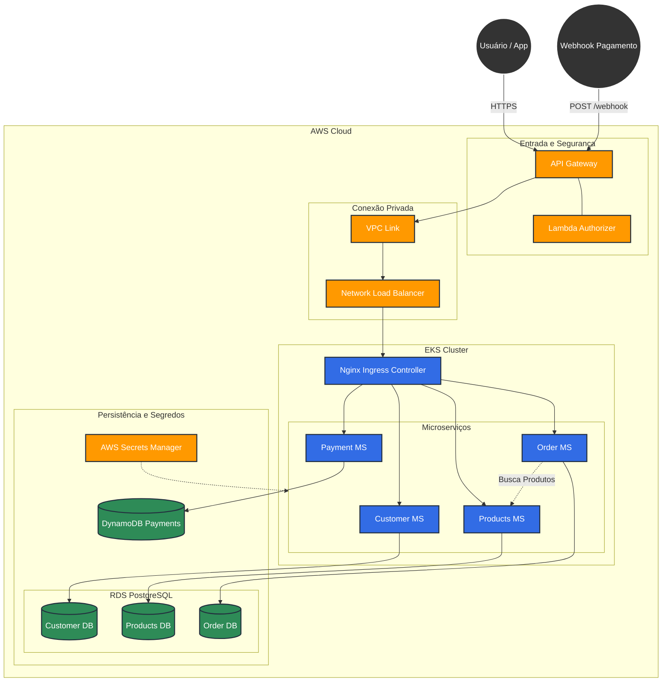

# soat-tech-challenge4-app-products

## Integrantes - Grupo 194 do Tech Challenge
*   Thiago Frozzi Ramos - RM363916
*   Denise da Silva Ferreira - RM360753
*   Fabio Luiz de Melo - RM 361064
*   Humberto Moura Feitoza - RM360753
*   Byanca Andreatto Maria - RM363193

---

## Principais alterações na arquitetura

A principal mudança realizada no projeto foi a transição de uma arquitetura Monolítica (centralizada) para uma arquitetura distribuída baseada em Microserviços.

### 1. O Cenário Anterior (Monolito)
Anteriormente, o sistema era composto por uma única aplicação Java que continha todas as regras de negócio (Clientes, Produtos, Pedidos e Pagamentos) e se conectava a um único banco de dados relacional (PostgreSQL) compartilhado, onde todas as tabelas residiam juntas.

*   **Problema de Acoplamento:** Uma falha crítica em um módulo (ex: Pagamentos) poderia comprometer a disponibilidade de toda a aplicação, paralisando operações não relacionadas, como o cadastro de clientes.
*   **Escalabilidade Ineficiente:** Para aumentar a capacidade de processamento de um módulo específico, era necessário escalar a aplicação inteira, desperdiçando recursos computacionais em módulos que não precisavam de expansão.

### 2. A Nova Arquitetura (Microserviços)
O sistema foi refatorado e desacoplado em 4 microserviços independentes, cada um com responsabilidade única e isolamento de dados, seguindo o padrão arquitetural "Database per Service" (Banco de Dados por Serviço).

**Detalhamento das Mudanças:**

*   **Desacoplamento de Domínios de Negócio:**
    *   **Customer App:** Responsável exclusivamente pelo ciclo de vida e dados do cliente.
    *   **Products App:** Gerencia o catálogo de produtos e categorias.
    *   **Order App:** Centraliza a orquestração e o fluxo de vida do pedido.
    *   **Payment App:** Dedicado ao processamento de transações financeiras e integrações externas (Webhooks).

*   **Estratégia de Dados (Database per Service):**
    *   Foi eliminado o compartilhamento de banco de dados. Cada microserviço possui seu próprio armazenamento, garantindo que nenhum serviço acesse diretamente as tabelas de outro.
    *   **PostgreSQL:** Mantido para os serviços Customer, Products e Order, que lidam com dados relacionais e transacionais estruturados.
    *   **DynamoDB (NoSQL):** Adotado estrategicamente para o microserviço de Payment. A escolha por um banco NoSQL gerenciado visa oferecer baixa latência, alta disponibilidade e escalabilidade automática para suportar o alto volume de requisições de pagamento e atualizações de status via webhook.

*   **Comunicação entre Serviços:**
    *   A comunicação direta via banco de dados foi substituída por comunicação via API (HTTP/REST). Por exemplo, quando o serviço Order necessita validar um produto, ele realiza uma requisição síncrona ao serviço Products, respeitando os contratos de interface e mantendo o encapsulamento.

---

## 🏛️ Arquitetura do Sistema

O sistema segue o padrão de **Microserviços em Cluster Kubernetes (EKS)** na AWS, utilizando serviços gerenciados para dados, segurança e roteamento.

### 🧩 Componentes Principais

#### 1. Entrada e Segurança (Edge)
*   **API Gateway:** Ponto único de entrada (REST). Gerencia rotas (`/orders`, `/payments`, etc.) e protege o cluster.
*   **Lambda Authorizer:** Função Serverless para validação de segurança (Token/CPF) antes do acesso.

#### 2. Rede e Distribuição
*   **VPC Link & NLB:** Conecta o API Gateway público ao cluster EKS privado de forma segura.
*   **Ingress Controller (Nginx):** Roteia o tráfego interno para os microserviços corretos.

#### 3. Microserviços (Java Spring Boot)
*   **Customer App:** Gestão de clientes (PostgreSQL).
*   **Products App:** Catálogo de produtos (PostgreSQL).
*   **Order App:** Orquestração de pedidos (PostgreSQL). Comunica-se internamente com o Products App.
*   **Payment App:** Processamento de pagamentos e Webhooks (DynamoDB).

#### 4. Dados
*   **Amazon RDS (PostgreSQL):** Armazena dados relacionais de Clientes, Produtos e Pedidos.
*   **Amazon DynamoDB:** Banco NoSQL para alta performance no processamento de Pagamentos.
*   **AWS Secrets Manager:** Gestão segura e rotativa de credenciais de banco de dados.

### 📌 Endpoints da API (Sistema Completo)

| Microserviço | Método | Rota | Descrição |
| :--- | :--- | :--- | :--- |
| **Customer** | `POST` | `/customers/create` | Cria um novo cadastro de cliente. |
| **Customer** | `GET` | `/customers/{cpf}` | Consulta os dados de um cliente pelo CPF. |
| **Products** | `POST` | `/products/create` | Adiciona um novo produto ao catálogo. |
| **Products** | `PUT` | `/products/update` | Atualiza os dados de um produto existente. |
| **Products** | `GET` | `/products/category/{category}` | Lista produtos por categoria (ex: Lanche, Bebida). |
| **Products** | `GET` | `/products/id/{id}` | Busca detalhes de um produto pelo ID. |
| **Products** | `GET` | `/products/name/{name}` | Busca produtos pelo nome. |
| **Order** | `POST` | `/orders/checkout` | Cria um novo pedido (Checkout). |
| **Order** | `GET` | `/orders` | Lista todos os pedidos realizados. |
| **Order** | `GET` | `/orders/{orderId}` | Busca detalhes de um pedido específico. |
| **Order** | `PATCH` | `/orders/{orderId}/status/{orderStatus}` | Atualiza o status do pedido (ex: Recebido -> Preparando -> Pronto). |
| **Payment** | `POST` | `/payments/create` | Inicia um novo processo de pagamento. |
| **Payment** | `GET` | `/payments/{paymentId}/status` | Consulta o status atual de um pagamento. |
| **Payment** | `POST` | `/webhook/payments` | Recebe a notificação (callback) da operadora de cartão. |
| **Payment** | `POST` | `/mock/payments` | Endpoint de simulação (Mock) para testes. |

### 📐 Diagrama de Arquitetura

---

## 📊 Qualidade de Código - SonarCloud

### Cobertura de Testes
*(Insira aqui o print da cobertura de testes do SonarCloud)*

### Projeto no SonarCloud
[🔗 Clique aqui para acessar o dashboard do projeto no SonarCloud](https://sonarcloud.io/organizations/techfiap/)

---

## 📂 Repositórios do Projeto

### Infraestrutura
*   [Infra EKS (Kubernetes)](https://github.com/humbfei-fiap/soat-tech-challenge-infra-eks)
*   [Infra Database (PostgreSQL)](https://github.com/humbfei-fiap/soat-tech-challenge-infra-postgres)
*   [Infra Database (DynamoDB)](https://github.com/TechFiap/soat-tech-challenge-infra-dynamodb)
*   [Infra Gateway & Lambda](https://github.com/humbfei-fiap/soat-tech-challenge-infra-gtw-lambda)
*   [Infra IAM Roles](https://github.com/humbfei-fiap/soat-tech-challenge-infra-roles)

### Microserviços (APIs)
*   [App Customer](https://github.com/TechFiap/soat-tech-challenge4-app-customer)
*   [App Products](https://github.com/TechFiap/soat-tech-challenge4-app-products)
*   [App Order](https://github.com/TechFiap/soat-tech-challenge4-app-order)
*   [App Payment](https://github.com/TechFiap/soat-tech-challenge4-app-payment)
